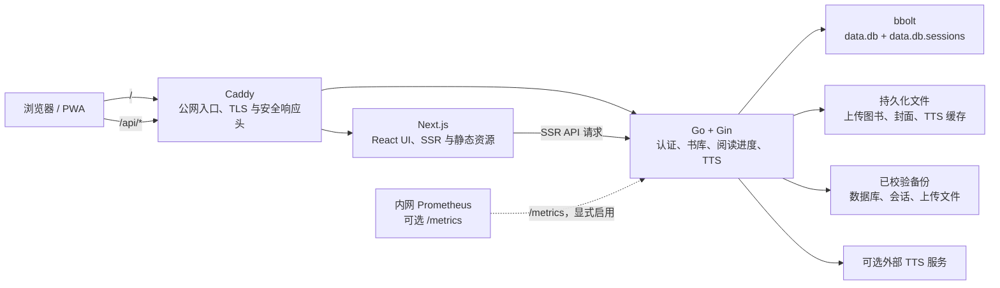

# 架构说明

Z Reader 是面向个人和家庭书架的单体、自部署应用。设计重点是让一台主机即可获得可靠的
阅读、同步、备份与恢复能力；它不是多租户 SaaS，也不支持多节点同时写入同一个书库。

## 系统全景

Docker 镜像内有三个进程：Caddy 对外监听 80/443，Next.js 监听本地 3000，Go 服务监听本地
8080。Caddy 将 `/api/*`、`/healthz` 和 `/readyz` 代理到 Go；其他请求交给
Next.js。这样浏览器默认采用同源 API，部署时不必公开内部端口或配置跨域。

## 组件职责与边界

| 组件 | 负责什么 | 不负责什么 |
| --- | --- | --- |
| 浏览器与 PWA | UI、阅读状态、离线阅读副本和离线进度队列 | 不直接访问数据库、上传目录或内部指标 |
| Next.js | React 页面、SSR 和同源 API rewrite | 业务数据的权威写入 |
| Go + Gin | 认证、授权、书籍、进度、书签、上传、备份、健康检查 | TLS 终止、长期对象存储或多节点协调 |
| bbolt 与上传目录 | 书库元数据、会话、进度及原始文件的持久化 | 多主复制或跨节点共享写入 |
| Caddy | TLS、压缩、安全响应头和反向代理 | 用户认证、数据存储或指标公开 |
| Prometheus 等外部采集器 | 内网指标、磁盘和就绪探测 | 改变应用行为或保存用户数据 |

信任边界很明确：只有 Caddy 暴露到公网；Go 对数据库和上传目录有写权限；指标默认关闭，
即使启用也不经 Caddy 公开。外部 TTS 服务是可选依赖，应用不会在仓库或镜像中包含可用凭据。

## 数据与一致性

- `data.db` 保存用户、书籍、书签、阅读进度和索引；`data.db.sessions` 保存登录会话，
  以减轻会话读写对主库的锁竞争。
- `uploads/` 保存电子书与封面；TTS 缓存位于数据卷中。
- bbolt 迁移在服务启动时按版本顺序执行。一个部署只有一个应用写入者；不要把同一数据目录
  挂载到多个运行中的实例。
- 阅读进度保存支持乐观并发控制：客户端可提交上次更新时间，冲突时服务端返回当前进度。
- 自动备份使用在线数据库快照、上传文件副本和 SHA-256 清单；备份发布前校验，恢复只写入
  不存在的目标，防止覆盖仍需排查的数据。

数据恢复和升级步骤见[部署与运维手册](operations-runbook.md)。

## 请求路径

### 登录与授权

1. 浏览器将登录或注册请求发送到 `/api/*`。
2. Go 使用 bcrypt 校验密码，创建带过期时间的服务端会话。
3. 服务端以 HttpOnly、SameSite=Lax Cookie 返回会话标识；受保护 API 同时兼容 Cookie 和
   `Authorization` 请求头。
4. 中间件从独立会话库解析用户，再将用户 ID 放入请求上下文。登录、注册、上传和 TTS 都有
   独立限流。

### 书架、阅读与进度

1. 书架、搜索和阅读 API 必须经过认证，并按用户 ID 过滤数据。
2. 上传会校验文件格式和大小，处理 EPUB 元数据与封面，并把文件与元数据写入持久化路径。
3. 读取器在本地可暂存离线进度；恢复联网后再与进度 API 同步。
4. 进度写入更新进度时间索引和书架排序索引。性能基准和 HTTP 压测命令见
   [性能基线](performance-baseline.md)。

## 运行与可观测性

- `/healthz` 表示 HTTP 进程存活；`/readyz` 额外检查数据库和上传目录，部署探测应使用
  后者。
- 结构化日志带请求 ID，HTTP 指标仅使用方法、路由模板和状态码等低基数标签。
- `METRICS_ENABLED=true` 才会开放 Prometheus 格式的 `/metrics`，并应只通过内网采集。
  备份失败、磁盘余量和外部就绪探测由日志、Node Exporter 与 Blackbox Exporter 等工具负责。
- CI 构建镜像后会启动容器，验证健康、就绪、Caddy 路由与持久化卷在容器替换后仍可用。

Prometheus、Grafana 和告警建议见[可观测性说明](observability.md)。

## 扩展边界

当前支持的扩展方式是**纵向扩展**：为单个实例提供更快的 CPU、更多内存和足够的本地磁盘，
并依据性能基线定位问题。bbolt 的单写事务和本地上传目录使主动—主动部署、不共享存储的
多实例部署不在支持范围内。需要高可用、多区域或跨主机存储时，应先设计独立的数据库、
对象存储、会话和备份恢复架构，而不是直接复制当前容器。
